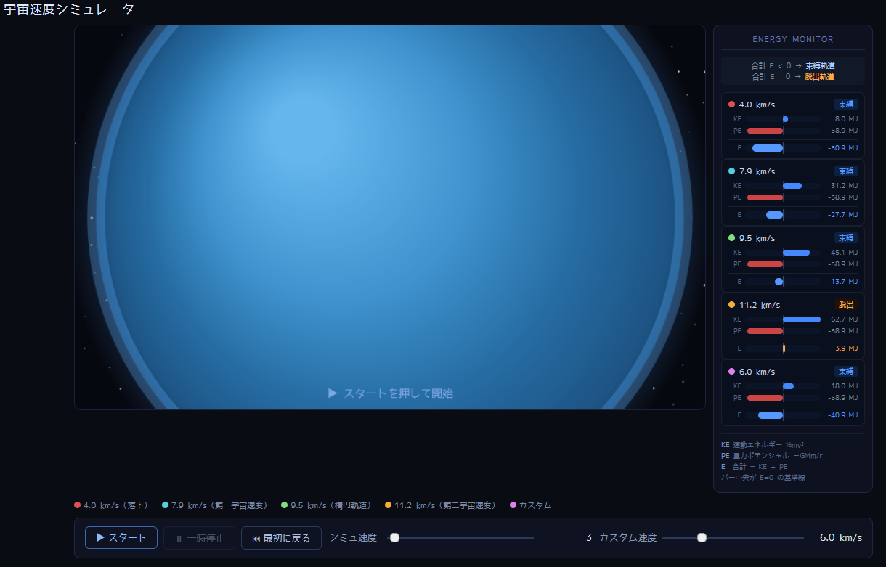

# 🚀 宇宙速度シミュレーター

**English version → [README_en.md](README_en.md)**

ブラウザだけで動く、インタラクティブな宇宙速度・軌道力学シミュレーターです。  
外部ライブラリへの依存はなく、HTMLファイル単体で完結します。



---

## ✨ 特徴

- **5種類の軌道を同時描画**
  - 4.0 km/s — 落下軌道（地球に衝突）
  - 7.9 km/s — 第一宇宙速度（円軌道）
  - 9.5 km/s — 楕円軌道（束縛状態）
  - 11.2 km/s — 第二宇宙速度（脱出軌道）
  - カスタム — スライダーで 1〜20 km/s を自由に設定
- **リアルタイム エネルギーモニター**
  - 運動エネルギー (KE)・重力ポテンシャル (PE)・合計エネルギー (E) をバー表示
  - 合計エネルギーの正負で「束縛 / 脱出」状態を色分け
- **自動ズームアウト** — 脱出軌道の天体を追跡してカメラが引いていく
- **スタート / 一時停止 / リセット** ボタン
- シミュレーション速度スライダー

---

## 🔭 物理的背景

| 速度 | 軌道の種類 | 合計エネルギー E |
|------|-----------|----------------|
| v < v₁ (7.9 km/s) | 落下軌道 | E < 0（落下） |
| v = v₁ | 円軌道（第一宇宙速度） | E < 0（最小束縛） |
| v₁ < v < v₂ | 楕円軌道 | E < 0（束縛状態） |
| v = v₂ (11.2 km/s) | 脱出軌道（第二宇宙速度） | E = 0 |
| v > v₂ | 双曲線軌道 | E > 0（非束縛） |

### エネルギーの式

```
運動エネルギー:     KE = ½mv²
重力ポテンシャル:   PE = −GMm/r
合計エネルギー:     E  = KE + PE
```

- **E < 0** → 束縛軌道（円・楕円）  
- **E ≥ 0** → 脱出軌道（放物線・双曲線）

エネルギーモニターの中央縦線が **E = 0 の基準線** です。  
カスタムスライダーを 11.2 km/s 付近でゆっくり動かすと、バーがゼロを越えてオレンジに変わる瞬間を確認できます。

---

## 🚀 使い方

### ブラウザで直接開く

```bash
git clone https://github.com/YOUR_USERNAME/cosmic-velocity-simulator.git
cd cosmic-velocity-simulator
open cosmic_velocity_simulator.html        # macOS
start cosmic_velocity_simulator.html       # Windows
xdg-open cosmic_velocity_simulator.html   # Linux
```

### GitHub Pages で公開する場合

リポジトリの **Settings → Pages → Source** を `main` ブランチのルートに設定するだけで、  
以下のURLで公開されます。

```
https://YOUR_USERNAME.github.io/cosmic-velocity-simulator/cosmic_velocity_simulator.html
```

---

## 🎮 操作方法

| 操作 | 説明 |
|------|------|
| ▶ スタート | シミュレーション開始 |
| ⏸ 一時停止 | 途中で止める（再度スタートで再開） |
| ⏮ 最初に戻る | 完全リセット |
| シミュ速度スライダー | 時間の進む速さを調整（1〜100） |
| カスタム速度スライダー | 紫の軌道の初速を設定（1〜20 km/s） |

---

## 🛠 技術仕様

| 項目 | 内容 |
|------|------|
| 言語 | HTML / CSS / Vanilla JavaScript |
| 外部依存 | なし（ゼロ依存） |
| 物理演算 | RK4相当（4ステップ分割オイラー法） |
| レンダリング | Canvas 2D API |
| 対応ブラウザ | Chrome / Firefox / Safari / Edge（モダンブラウザ全般） |

---

## 📁 ファイル構成

```
cosmic-velocity-simulator/
├── cosmic_velocity_simulator.html  # シミュレーター本体（これ一つで完結）
├── README.md                       # 日本語ドキュメント（このファイル）
└── README_en.md                    # English documentation
```

---

## 📝 ライセンス

MIT License — 教育・研究・改変・再配布、すべて自由です。

---

## 👤 作者

**けんしょう**  
- Niconico: [窮理学](https://www.nicovideo.jp/) — 物理・宇宙解説シリーズ  
- GitHub: [@YOUR_USERNAME](https://github.com/YOUR_USERNAME)
